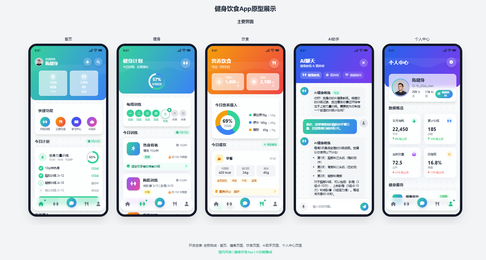

# PuffChat App - 健身饮食应用原型

这是一个健身饮食类应用的高保真原型，旨在帮助用户追踪健身进度、饮食营养摄入并提供AI辅助功能。采用现代化设计风格，使用玻璃拟态、渐变色等视觉效果，提供简洁而专业的用户体验。

## 项目结构

```
├── pages/                # 功能页面
│   ├── home.html         # 首页
│   ├── workout.html      # 健身页面
│   ├── nutrition.html    # 营养饮食页面
│   ├── ai-assistant.html # AI聊天助手页面
│   └── profile.html      # 个人中心页面
├── index.html            # 主入口文件，展示所有页面
├── index-starter.html    # 初始框架文件
├── README.md             # 项目说明文档
└── prompts.md            # 设计提示词文档
```

## 主页面预览



上图展示了PuffChat应用的主页界面，采用了现代化的玻璃拟态设计风格，清晰展示了用户的健身数据、营养摄入和训练计划等核心信息。

## 技术栈

- **HTML5** - 提供基础结构
- **Tailwind CSS** - 通过CDN引入，实现响应式设计和现代化UI
- **JavaScript** - 提供基本的交互功能
- **Font Awesome** - 提供图标支持
- **玻璃拟态/渐变设计** - 提供现代感的视觉效果

## 设计特点

### 视觉风格

- **玻璃拟态 (Glassmorphism)** - 半透明卡片效果，增强层次感和质感
- **渐变色背景** - 使用从蓝绿色(#34D399)到深蓝色的渐变，提供现代感
- **纯图标导航** - 底部导航栏仅使用图标，简洁直观
- **圆角设计** - 所有卡片和按钮采用圆角设计，提供友好的视觉感受
- **阴影效果** - 精细的阴影设计增强深度感
- **动画过渡** - 卡片悬停和页面切换时的细微动画

### 交互设计

- **AI聊天体验** - 可滑动展开的AI助手聊天界面
- **进度可视化** - 环形进度条显示周目标完成度
- **卡片式布局** - 所有内容以卡片形式呈现，便于阅读
- **横向滚动列表** - 提供紧凑但信息丰富的内容展示
- **导航系统** - 底部标签导航，中央突出显示聊天入口

## 功能模块

### 首页

- 用户问候和数据概览
- 已消耗卡路里和训练时间统计
- AI训练推荐
- 今日计划与营养摄入
- 快速功能入口

### 健身模块

- 训练目标进度
- 今日训练计划详情
- 训练分类浏览
- 热门训练推荐
- 训练数据统计

### 营养模块

- 营养摄入进度
- 膳食计划建议
- 水分摄入追踪
- 食谱推荐
- 营养成分分析

### AI聊天

- 与AI健身教练对话
- 与AI营养师咨询
- 聊天角色切换功能
- 聊天历史记录
- 滑动式界面交互

### 个人中心

- 用户资料展示
- 关注与粉丝数据
- 健身数据统计
- 健康服务入口
- 个人设置选项

## 如何使用

1. 直接在浏览器中打开 `index.html` 查看所有页面布局
2. 点击导航到各功能页面查看详细设计：
   - 首页: `pages/home.html`
   - 健身页面: `pages/workout.html`
   - 营养页面: `pages/nutrition.html`
   - AI聊天: `pages/ai-assistant.html`
   - 个人中心: `pages/profile.html`
3. 所有界面均按照iPhone尺寸(390x844px)设计，在移动设备或桌面浏览器中均可查看

## 设计说明

该原型采用玻璃拟态设计风格，重点突出了核心健身和饮食功能，移除了非必要的心率监测、会员等级和徽章系统，使界面更加简洁专注。底部导航栏采用纯图标设计，中间突出显示聊天图标作为AI交流的入口。

## 兼容性

- 推荐使用Chrome、Safari、Firefox等现代浏览器
- 支持移动端和桌面端查看
- 为移动设备优化的交互体验